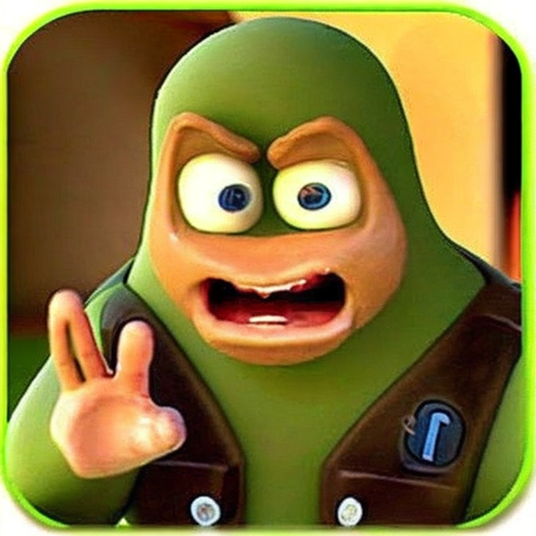
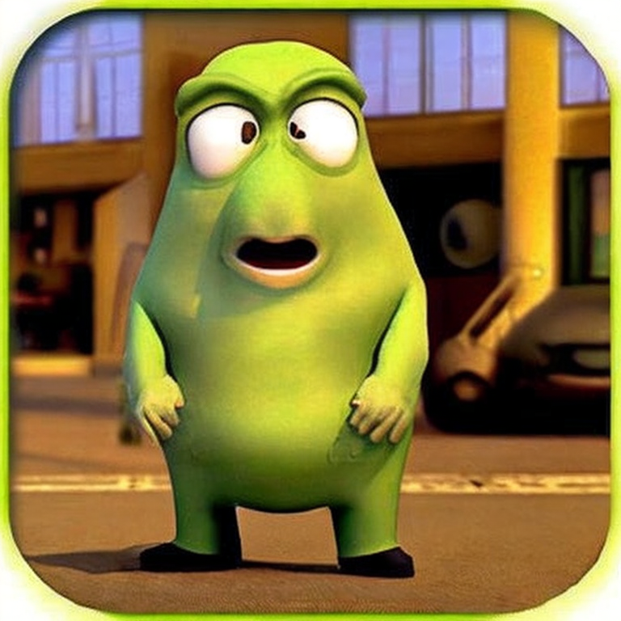
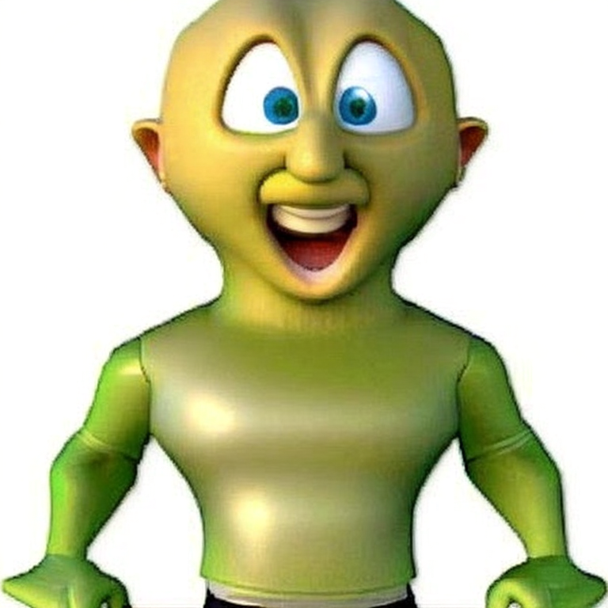
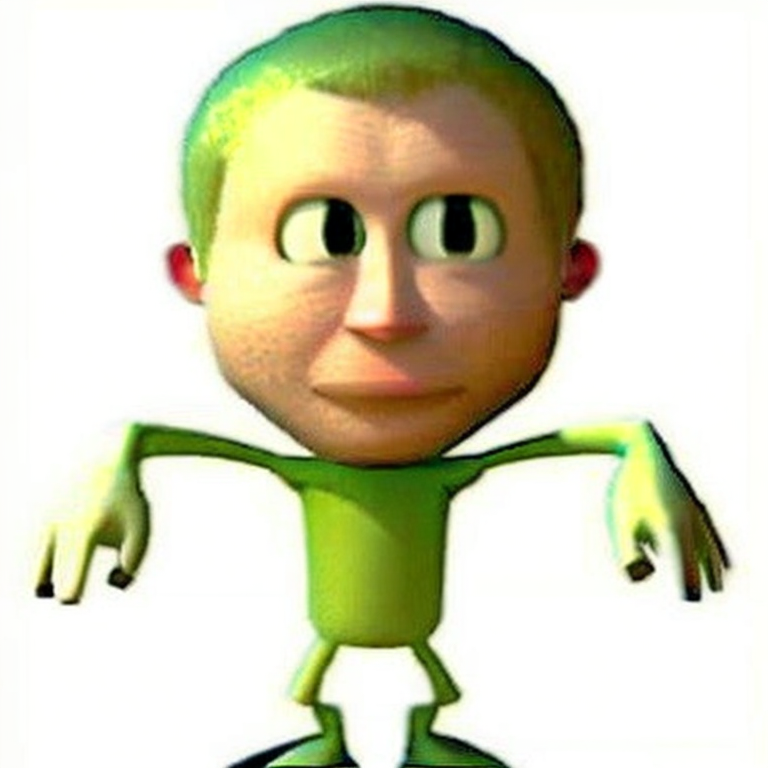
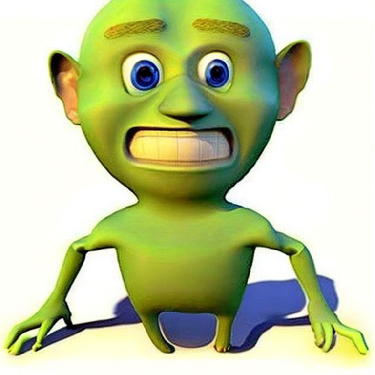

# Diffusion-Remix
## Stable Diffusion implementation of Midjourney Remix

### Usage

```python3
  python run.py content_image.png style_image.png
```

### Example

### From Text Task

Boromir content            | Wazovski style
:-------------------------:|:-------------------------:
   |
             

Results1                   | Results2                  | Results3                  | Results4
:-------------------------:|:-------------------------:|:-------------------------:|:-------------------------:
   |   |   | 


Content image              | Style image
:-------------------------:|:-------------------------:
   |


Results1                   | Results2                  | Results3                  | Results4
:-------------------------:|:-------------------------:|:-------------------------:|:-------------------------:
          |          |          |
